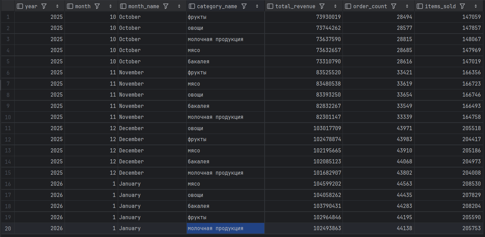
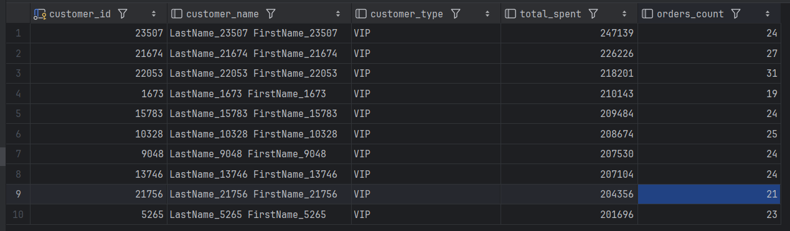
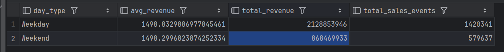
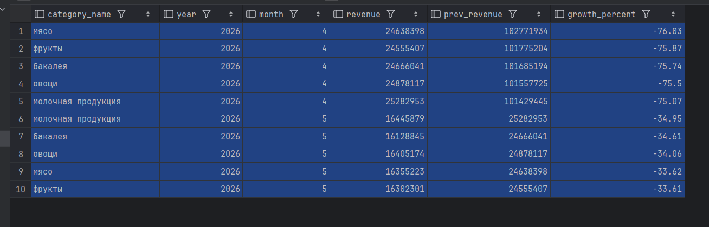

### Аналитические вопросы
1. Динамика выручки по месяцам и категориям товаров.
2. Топ‑10 клиентов по выручке с их типом (VIP, Постоянный, Обычный, Новый).
3. Сравнение продаж в будние дни и выходные.
4. (Дополнительно) Категории с падением продаж относительно предыдущего месяца.

### Проектирование модели

#### Факт
- **Таблица**: `olap.fact_sales`
- **Зерно**: одна строка = одна позиция заказа (одна запись из `warehouse.order_item`)
- **Меры**: `quantity` (количество товара), `revenue` (выручка = quantity * unit_price)

#### Измерения

| Измерение | Таблица | Ключевые атрибуты |
|-----------|---------|-------------------|
| Дата | `dim_date` | год, квартал, месяц, название месяца, день недели, выходной/будни |
| Товар | `dim_product` | название товара, категория, цена, поставщик |
| Клиент | `dim_customer` | имя, фамилия, email, тип (вычисляется функцией `rate_customer`) |
| Склад | `dim_warehouse` | название склада, адрес, менеджер |

### Реализация в PostgreSQL

#### Создание схемы и таблиц (`create_olap_schema.sql`)

```sql
CREATE SCHEMA IF NOT EXISTS olap;

CREATE TABLE olap.dim_date (
    date_id     INT PRIMARY KEY,
    full_date   DATE NOT NULL,
    year        SMALLINT,
    quarter     SMALLINT,
    month       SMALLINT,
    month_name  VARCHAR(9),
    day         SMALLINT,
    day_of_week SMALLINT,
    is_weekend  BOOLEAN
);

CREATE TABLE olap.dim_product (
    product_id    INT PRIMARY KEY,
    product_name  VARCHAR(100),
    category_id   INT,
    category_name VARCHAR(100),
    unit_price    INT,
    supplier_id   INT,
    supplier_name VARCHAR(100)
);

CREATE TABLE olap.dim_customer (
    customer_id   INT PRIMARY KEY,
    last_name     VARCHAR(50),
    first_name    VARCHAR(50),
    email         VARCHAR(100),
    customer_type VARCHAR(20)
);

CREATE TABLE olap.dim_warehouse (
    warehouse_id INT PRIMARY KEY,
    name         VARCHAR(31),
    address      VARCHAR(200),
    manager_name TEXT
);

CREATE TABLE olap.fact_sales (
    sale_id      BIGSERIAL PRIMARY KEY,
    order_id     INT NOT NULL,
    date_id      INT NOT NULL REFERENCES olap.dim_date(date_id),
    product_id   INT NOT NULL REFERENCES olap.dim_product(product_id),
    customer_id  INT NOT NULL REFERENCES olap.dim_customer(customer_id),
    warehouse_id INT REFERENCES olap.dim_warehouse(warehouse_id),
    quantity     INT NOT NULL,
    revenue      INT NOT NULL
);
```

#### Заполнение данными (`populate_olap.sql`)

Скрипт выполняет полный ETL:
- Удаляет и пересоздаёт схему `olap` (чтобы гарантировать чистоту).
- Создаёт все таблицы.
- Создаёт индекс на `warehouse.customer_order(customer_id)` для ускорения функции `rate_customer`.
- Заполняет измерения:
    - `dim_date` – генерация всех дат между минимальной и максимальной датой заказа.
    - `dim_product` – объединение `product_catalog`, `product_category`, `supplier`.
    - `dim_customer` – все клиенты с вызовом `warehouse.rate_customer(id)`.
    - `dim_warehouse` – объединение `warehouse` и `manager`.
- Заполняет `fact_sales` **порциями по 100 000 строк** (чтобы избежать перегрузки транзакции).

**Результаты заполнения** (по последнему успешному запуску):

| Таблица | Количество строк |
|---------|------------------|
| `dim_date` | 231 |
| `dim_product` | 500 000 |
| `dim_customer` | 500 000 |
| `dim_warehouse` | 2 |
| `fact_sales` | 1 999 978 |

Время вставки `fact_sales`: ≈3 мин 34 сек.

### Аналитические запросы и результаты

#### Динамика выручки по месяцам и категориям

```sql
SELECT d.year, d.month, d.month_name, p.category_name,
       SUM(f.revenue) AS total_revenue,
       COUNT(DISTINCT f.order_id) AS order_count,
       SUM(f.quantity) AS items_sold
FROM olap.fact_sales f
JOIN olap.dim_date d ON f.date_id = d.date_id
JOIN olap.dim_product p ON f.product_id = p.product_id
GROUP BY d.year, d.month, d.month_name, p.category_name
ORDER BY d.year, d.month, total_revenue DESC
LIMIT 20;
```

**Результат**


**Вывод:** Выручка плавно растёт от октября 2025 к январю 2026; все категории имеют сопоставимые показатели.

#### Топ‑10 клиентов по выручке

```sql
SELECT c.customer_id, c.last_name || ' ' || c.first_name AS customer_name,
       c.customer_type, SUM(f.revenue) AS total_spent,
       COUNT(DISTINCT f.order_id) AS orders_count
FROM olap.fact_sales f
JOIN olap.dim_customer c ON f.customer_id = c.customer_id
GROUP BY c.customer_id, c.last_name, c.first_name, c.customer_type
ORDER BY total_spent DESC LIMIT 10;
```

**Результат:**



#### Продажи в будни и выходные

```sql
SELECT CASE WHEN d.is_weekend THEN 'Weekend' ELSE 'Weekday' END AS day_type,
       AVG(f.revenue) AS avg_revenue, SUM(f.revenue) AS total_revenue,
       COUNT(*) AS total_sales_events
FROM olap.fact_sales f
JOIN olap.dim_date d ON f.date_id = d.date_id
GROUP BY d.is_weekend;
```

**Результат:**



**Вывод:** Средний чек практически одинаков, но в будни совершается в 2,45 раза больше покупок, чем в выходные.

#### Категории с падением продаж месяц к месяцу

```sql
WITH monthly AS (...), prev AS (...)
SELECT category_name, year, month, revenue, prev_revenue,
       ROUND(100.0 * (revenue - prev_revenue) / prev_revenue, 2) AS growth_percent
FROM prev WHERE prev_revenue IS NOT NULL
ORDER BY growth_percent ASC LIMIT 10;
```

**Результат:**



**Вывод:** В апреле 2026 года наблюдается резкое падение выручки по всем категориям (около 75% по сравнению с предыдущим месяцем). В мае падение замедляется (около 34%). Это может быть связано с сезонностью или неполнотой данных за эти месяцы.

### Заключение

- Модель «звезда» спроектирована и полностью реализована в схеме `olap`.
- Данные успешно перенесены из OLTP-схемы `warehouse` (почти 2 миллиона фактов).
- Благодаря созданному индексу функция `rate_customer` отработала быстро (5.5 секунд на 500 000 клиентов), поле `customer_type` заполнено корректно.
- Все аналитические запросы выполняются за секунды и дают осмысленную бизнес-информацию.
- Результаты подтверждают: выручка растёт, топ-клиенты тратят много, будни существенно активнее выходных, а весной 2026 года наблюдается спад продаж.
