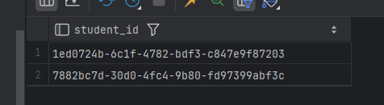
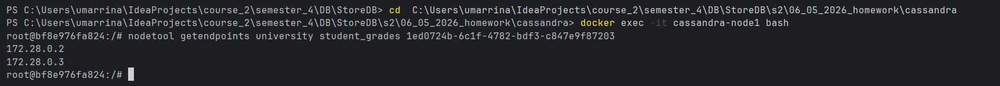
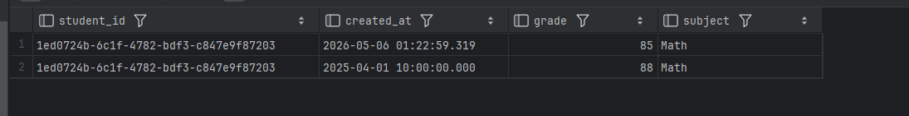

# Домашнее задание №5: Cassandra

## Задание

1. Запустить кластер (2 ноды).
2. Создать Keyspace `university` с репликацией 2.
3. Создать таблицу `student_grades`:
    - `student_id uuid`, `created_at timestamp`, `subject text`, `grade int`
    - PRIMARY KEY (student_id, created_at)
4. Вставить по 2 записи для двух разных студентов.
5. Проверить распределение данных с помощью `nodetool getendpoints`.
6. Написать запрос с фильтром по неключевому полю (`subject`), убедиться в ошибке, затем выполнить с `ALLOW FILTERING`.

## Запуск

```bash
docker compose up -d
docker exec -it cassandra-node1 cqlsh
```

## Решения

```cql
-- 2. Keyspace с репликацией 2
CREATE KEYSPACE university
WITH replication = {'class': 'SimpleStrategy', 'replication_factor': 2};

USE university;
```

```cql
-- 3. Таблица
CREATE TABLE student_grades (
    student_id uuid,
    created_at timestamp,
    subject text,
    grade int,
    PRIMARY KEY (student_id, created_at)
) WITH CLUSTERING ORDER BY (created_at DESC);
```

```cql
-- 4. Вставка данных
INSERT INTO student_grades (student_id, created_at, subject, grade)
VALUES (uuid(), toTimestamp(now()), 'Math', 85);

INSERT INTO student_grades (student_id, created_at, subject, grade)
VALUES (uuid(), toTimestamp(now()), 'Physics', 90);

-- Для второго студента (сгенерировать другой uuid - скопировать из SELECT)
-- Сначала посмотрим существующие id:
SELECT student_id FROM student_grades;

-- Затем вставим ещё по две записи для каждого студента с разными временами
INSERT INTO student_grades (student_id, created_at, subject, grade)
VALUES (1ed0724b-6c1f-4782-bdf3-c847e9f87203, '2025-04-01 10:00:00', 'Math', 88);
INSERT INTO student_grades (student_id, created_at, subject, grade)
VALUES (7882bc7d-30d0-4fc4-9b80-fd97399abf3c, '2025-04-02 11:00:00', 'Physics', 92);
-- аналогично для второго студента (замените UUID на реальный)
```



```cql
-- 5. Проверка распределения 
-- docker exec -it cassandra-node1 bash
nodetool getendpoints university student_grades 1ed0724b-6c1f-4782-bdf3-c847e9f87203
```



```cql
-- 6. Поиск по subject 
SELECT * FROM student_grades WHERE subject = 'Math';
```

э

```cql
-- Добавим ALLOW FILTERING 
SELECT * FROM student_grades WHERE subject = 'Math' ALLOW FILTERING;
```

