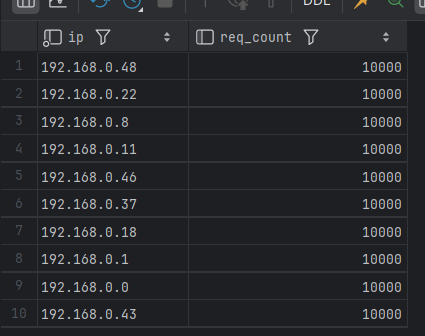
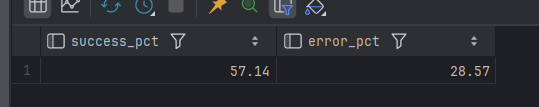
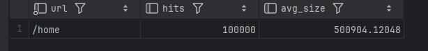
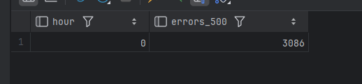
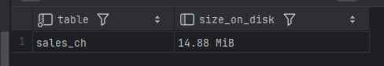

# Домашнее задание №2: ClickHouse

## Задание 1 – веб-логи

Создать таблицу `web_logs`, вставить 500k строк, выполнить:
1. Топ-10 IP по количеству запросов.
2. Процент успешных (2xx) и ошибочных (4xx,5xx).
3. Самый популярный URL и средний размер ответа.
4. Час с наибольшим количеством ошибок 500.

## Задание 2 – сравнение с PostgreSQL

Создать таблицы `sales_ch` и `sales_pg` (1 млн строк).
Сравнить:
- время вставки
- размер данных
- скорость аналитического запроса (например, продажи за месяц)

## Запуск

```bash
docker compose up -d
docker exec -it clickhouse-lab clickhouse-client --password password
docker exec -it postgres-lab psql -U postgres -d postgres
```

## Решение

**Создание таблицы и вставка данных**:

```sql
CREATE TABLE web_logs (
    log_time DateTime,
    ip String,
    url String,
    status_code UInt16,
    response_size UInt64
) ENGINE = MergeTree()
ORDER BY (log_time, status_code);

INSERT INTO web_logs
SELECT
    toDateTime('2024-03-01 00:00:00') + INTERVAL number SECOND,
    concat('192.168.0.', toString(number % 50)),
    arrayElement(['/home', '/api/users', '/api/orders', '/admin', '/products'], number % 5 + 1),
    arrayElement([200, 200, 200, 404, 500, 301, 200], number % 7 + 1),
    rand() % 1000000
FROM numbers(500000);
```

**Запросы**:

```sql
SELECT ip, count() AS req_count
FROM web_logs
GROUP BY ip
ORDER BY req_count DESC
LIMIT 10;

SELECT
    round(countIf(status_code BETWEEN 200 AND 299) / count() * 100, 2) AS success_pct,
    round(countIf(status_code >= 400) / count() * 100, 2) AS error_pct
FROM web_logs;

SELECT
    url,
    count() AS hits,
    avg(response_size) AS avg_size
FROM web_logs
GROUP BY url
ORDER BY hits DESC
LIMIT 1;

SELECT
    toHour(log_time) AS hour,
    count() AS errors_500
FROM web_logs
WHERE status_code = 500
GROUP BY hour
ORDER BY errors_500 DESC
LIMIT 1;
```









### Задание 2 (сравнение с PostgreSQL)

Создать таблицы `sales_ch` и `sales_pg`, вставить по 1 млн строк, выполнить замеры.

**ClickHouse**:

```sql
CREATE TABLE sales_ch (
    sale_date DateTime,
    product_id UInt64,
    category String,
    quantity UInt32,
    price Float64,
    customer_id UInt64
) ENGINE = MergeTree()
ORDER BY (sale_date);

INSERT INTO sales_ch
SELECT
    toDateTime('2024-01-01 00:00:00') + INTERVAL number MINUTE,
    number % 1000,
    arrayElement(['Electronics', 'Clothing', 'Food', 'Books'], number % 4 + 1),
    rand() % 10 + 1,
    round(rand() % 10000 / 100, 2),
    number % 50000
FROM numbers(1000000);
```

**PostgreSQL** 

```sql
CREATE TABLE sales_pg (
    sale_date timestamp,
    product_id bigint,
    category text,
    quantity integer,
    price float8,
    customer_id bigint
);
CREATE INDEX idx_sales_pg_date ON sales_pg(sale_date);
CREATE INDEX idx_sales_pg_product ON sales_pg(product_id);

INSERT INTO sales_pg
SELECT
    '2024-01-01 00:00:00'::timestamp + (n || ' minutes')::interval,
    n % 1000,
    CASE (n % 4)
        WHEN 0 THEN 'Electronics'
        WHEN 1 THEN 'Clothing'
        WHEN 2 THEN 'Food'
        ELSE 'Books'
    END,
    (random() * 9 + 1)::integer,
    round((random() * 100)::numeric, 2),
    n % 50000
FROM generate_series(1, 1000000) AS n;
```

**Замеры**:

- Вставка: 
Clickhouse:
```
[2026-05-06 02:54:52] default> CREATE TABLE sales_ch (
                                                         sale_date DateTime,
                                                         product_id UInt64,
                                                         category String,
                                                         quantity UInt32,
                                                         price Float64,
                                                         customer_id UInt64
                               ) ENGINE = MergeTree()
                                     ORDER BY (sale_date)
[2026-05-06 02:54:52] completed in 19 ms
[2026-05-06 02:54:52] default> INSERT INTO sales_ch
                               SELECT
                                   toDateTime('2024-01-01 00:00:00') + INTERVAL number MINUTE,
                                   number % 1000,
                                   arrayElement(['Electronics', 'Clothing', 'Food', 'Books'], number % 4 + 1),
                                   rand() % 10 + 1,
                                   round(rand() % 10000 / 100, 2),
                                   number % 50000
                               FROM numbers(1000000)
[2026-05-06 02:54:52] 1,000,000 rows affected in 147 ms
```

Postgres:
```
[2026-05-06 02:57:46] postgres.public> CREATE TABLE sales_pg (
                                                                 sale_date timestamp,
                                                                 product_id bigint,
                                                                 category text,
                                                                 quantity integer,
                                                                 price float8,
                                                                 customer_id bigint
                                       )
[2026-05-06 02:57:46] completed in 7 ms
[2026-05-06 02:57:46] postgres.public> CREATE INDEX idx_sales_pg_date ON sales_pg(sale_date)
[2026-05-06 02:57:46] completed in 7 ms
[2026-05-06 02:57:46] postgres.public> CREATE INDEX idx_sales_pg_product ON sales_pg(product_id)
[2026-05-06 02:57:46] completed in 8 ms
[2026-05-06 02:57:46] postgres.public> INSERT INTO sales_pg
                                       SELECT
                                           '2024-01-01 00:00:00'::timestamp + (n || ' minutes')::interval,
                                           n % 1000,
                                           CASE (n % 4)
                                               WHEN 0 THEN 'Electronics'
                                               WHEN 1 THEN 'Clothing'
                                               WHEN 2 THEN 'Food'
                                               ELSE 'Books'
                                               END,
                                           (random() * 9 + 1)::integer,
                                           round((random() * 100)::numeric, 2),
                                           n % 50000
                                       FROM generate_series(1, 1000000) AS n
[2026-05-06 02:58:11] 1,000,000 rows affected in 24 s 203 ms

```

- Размер данных:
```sql
SELECT 
    table, 
    formatReadableSize(sum(bytes)) AS size_on_disk
FROM system.parts
WHERE table = 'sales_ch' AND active = 1
GROUP BY table;
```
Clickhouse:



```sql
SELECT 
    pg_size_pretty(pg_total_relation_size('sales_pg')) AS total_size_with_indexes;
```
Postgres:


- Запрос продаж за последний месяц:

```sql
SELECT
    category,
    sum(price * quantity) AS total_revenue
FROM sales_ch
WHERE sale_date >= '2024-06-01' AND sale_date < '2024-07-01'
GROUP BY category
ORDER BY total_revenue DESC;
```

Clickhouse:
```
[2026-05-06 02:49:59] default> SELECT
                                   category,
                                   sum(price * quantity) AS total_revenue
                               FROM sales_ch
                               WHERE sale_date >= '2024-06-01' AND sale_date < '2024-07-01'
                               GROUP BY category
                               ORDER BY total_revenue DESC
[2026-05-06 02:49:59] 4 rows retrieved starting from 1 in 371 ms (execution: 26 ms, fetching: 345 ms)
```

```sql
SELECT 
    category, 
    sum(price * quantity) AS total_revenue
FROM sales_pg
WHERE sale_date >= '2024-06-01' AND sale_date < '2024-07-01'
GROUP BY category
ORDER BY total_revenue DESC;
```

Postgres:
```
[2026-05-06 02:48:54] postgres.public> SELECT
                                           category,
                                           sum(price * quantity) AS total_revenue
                                       FROM sales_pg
                                       WHERE sale_date >= '2024-06-01' AND sale_date < '2024-07-01'
                                       GROUP BY category
                                       ORDER BY total_revenue DESC
[2026-05-06 02:48:54] 4 rows retrieved starting from 1 in 445 ms (execution: 50 ms, fetching: 395 ms)
```

# Выводы

| Параметр | ClickHouse | PostgreSQL | Преимущество |
|---|---|---|---|
| Время вставки | 188 мс | 20 817 мс (≈20,8 с) | ClickHouse **быстрее в ~110 раз** |
| Размер данных на диске | 14,88 MiB | 102 MB | ClickHouse **эффективнее в ~6,9 раза** (лучшее сжатие) |
| Аналитический запрос (выручка за месяц, execution time) | 26 мс | 50 мс | ClickHouse **быстрее в ~1,9 раза** |

**Общий вывод:**
- ClickHouse идеально подходит для **массовой вставки** и **агрегаций на больших объёмах данных** 
- PostgreSQL остаётся выбором для **транзакционных нагрузок**, сложных `JOIN` и операций с частыми мелкими изменениями.
