# Домашнее задание №3: Elasticsearch

## Задание

1. Поднять Elasticsearch.
2. Создать индекс `first_index` с маппингом (title text с русским анализатором, price float, available boolean).
3. Заполнить данными (использовать Bulk из приложенной Postman коллекции или написать свои 10+ документов).
4. Написать 4 разных поисковых запроса:
    - `match` с опечаткой
    - `range` + `term`
    - `bool` с `must_not`
    - `match_phrase`

## Запуск

```bash
docker compose up -d
```

**Создание индекса**

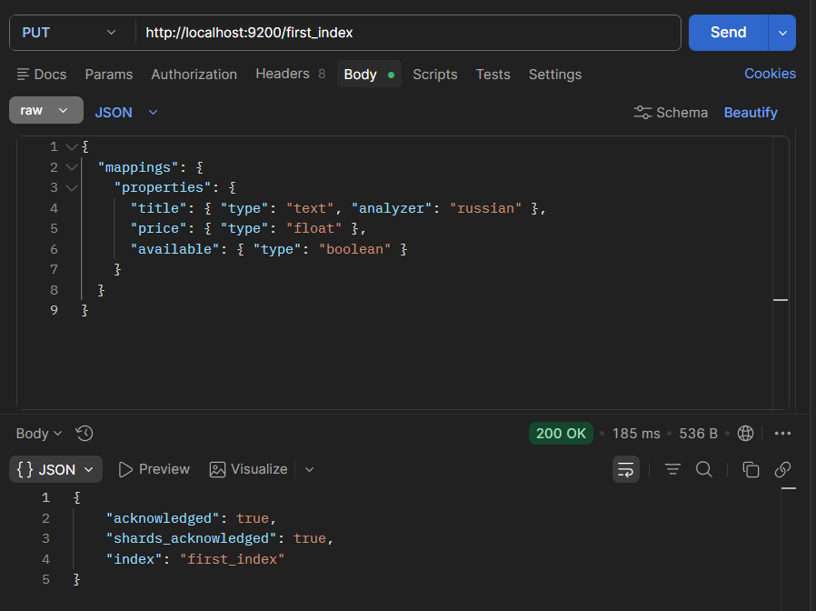

**Вставка документов**:

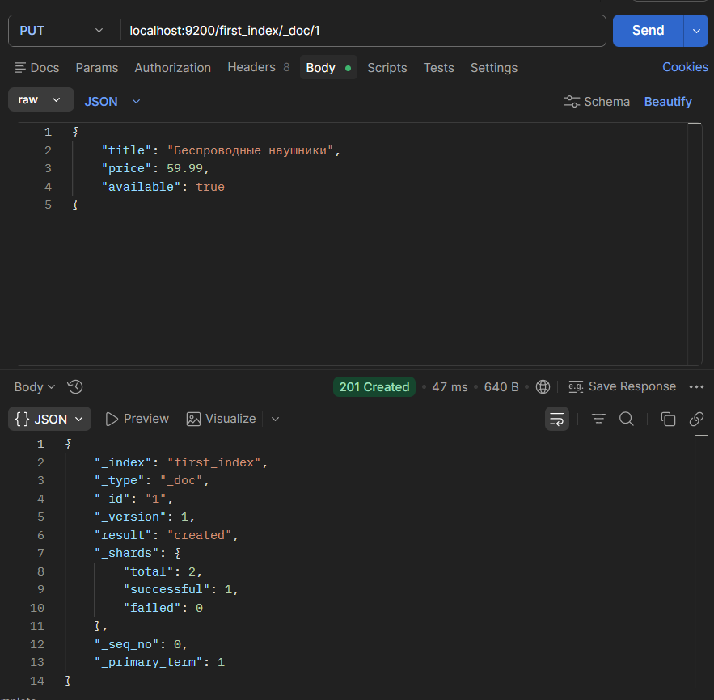

**Создание документа**

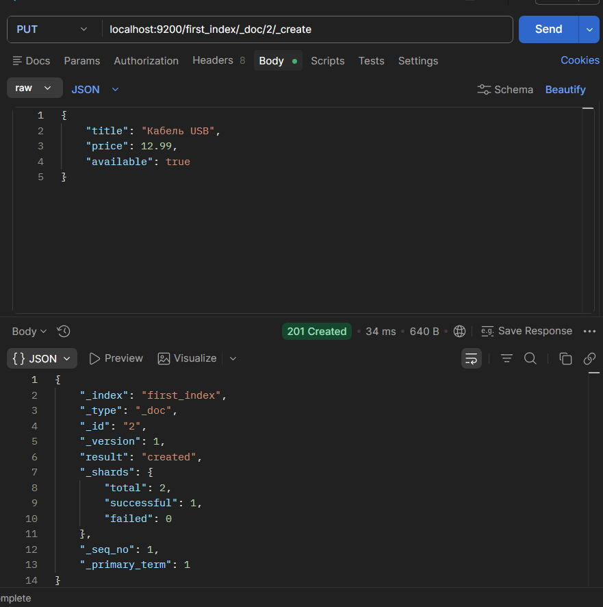

**Получение документа**

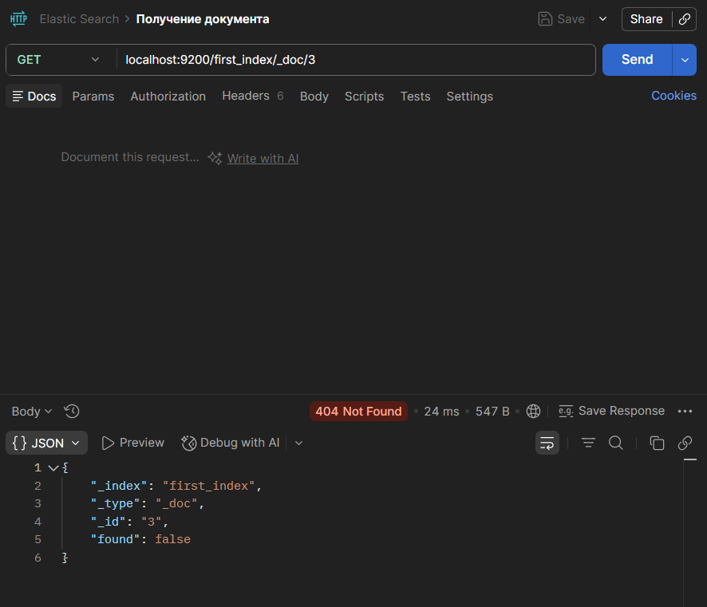

**Поиск**

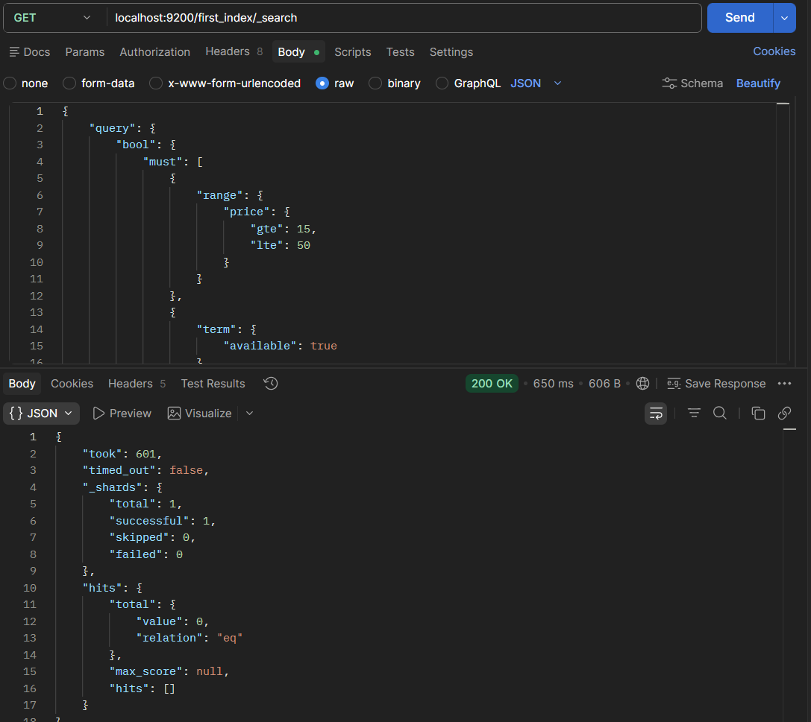

**Insert**

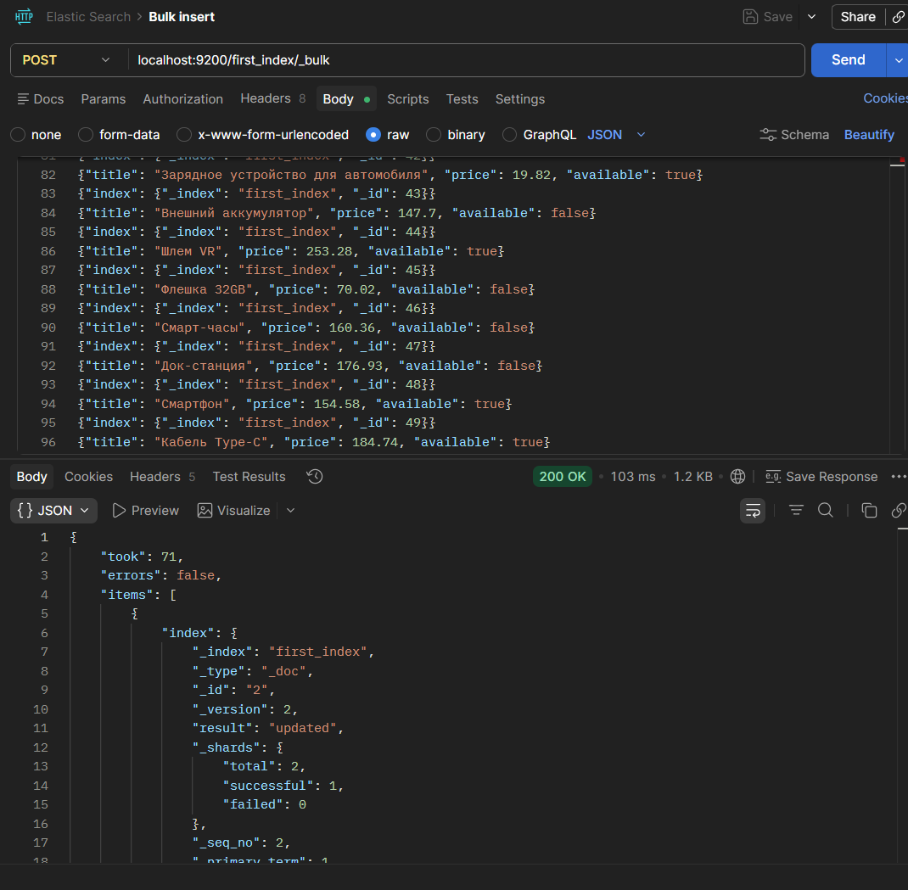

**Удаление документа**

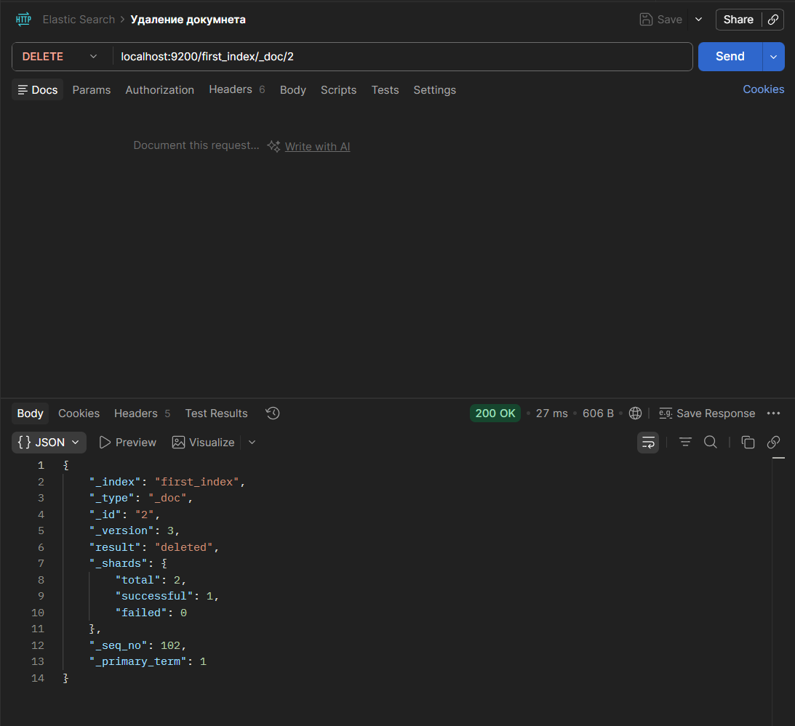

**match**

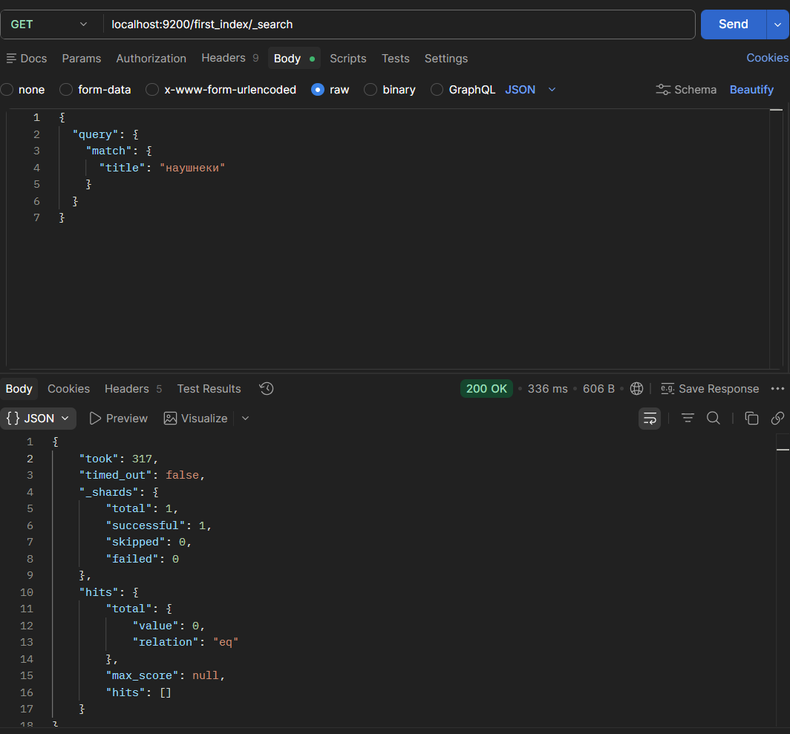

**range + term**

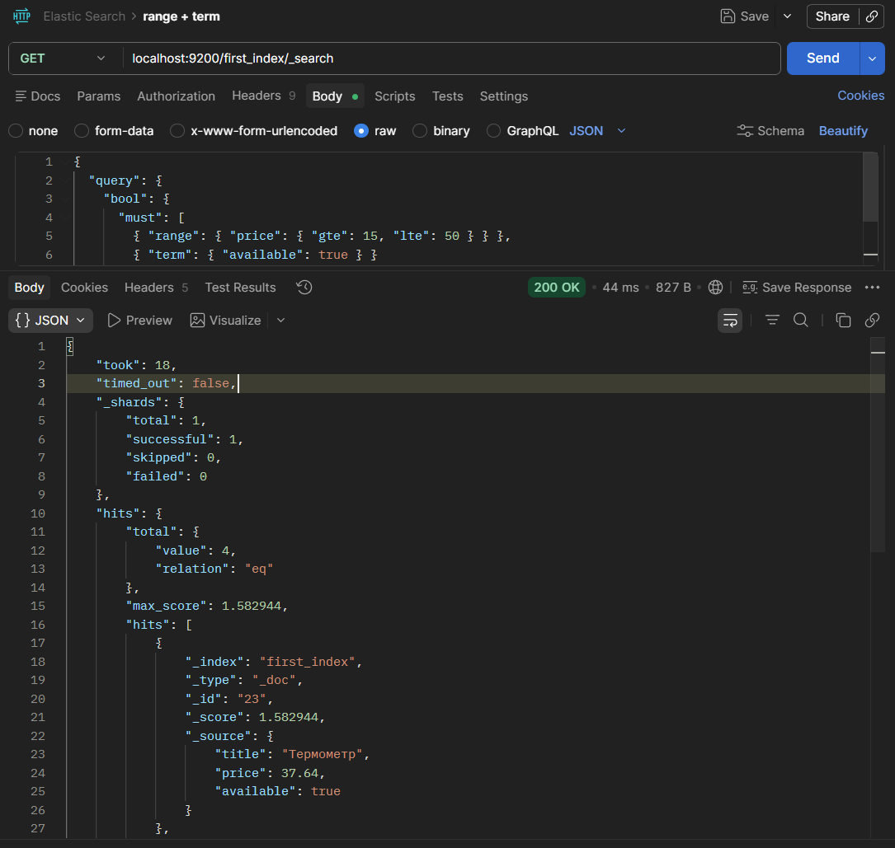

**bool**

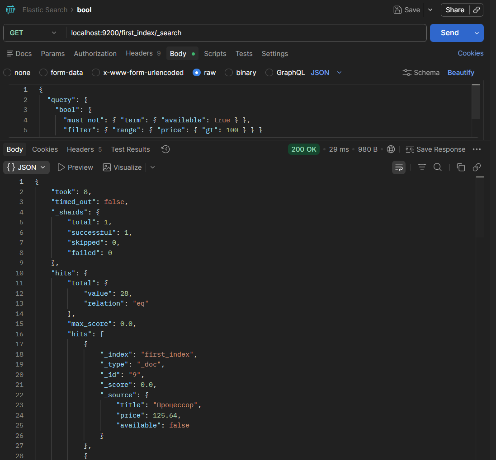

**match_phrase**

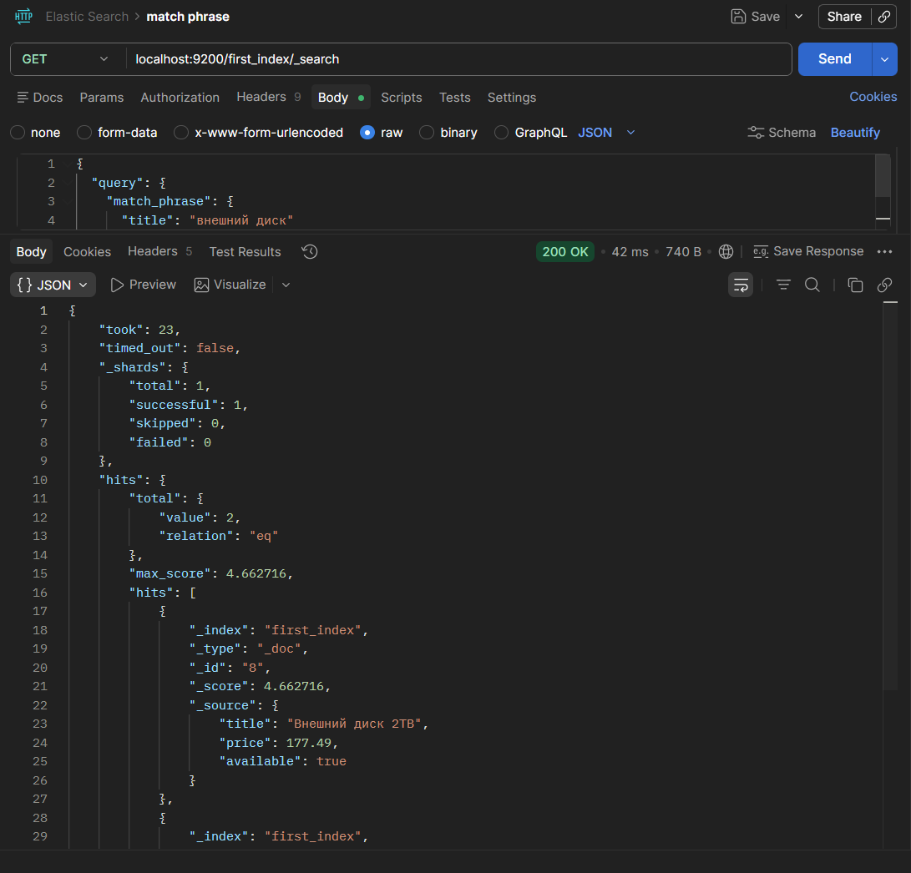
