# Домашнее задание №4: InfluxDB

## Задание

1. Запустить InfluxDB, открыть веб-интерфейс http://localhost:8086
2. Создать Bucket 
3. Наполнить данными промышленных датчиков через Line Protocol:
    - ток электродвигателя `current,motor_id=M-1001,type=induction load=high value=145.5`
    - давление в трубопроводе `pressure,pipe_id=MP-01,section=main zone=A value=4.2`
      (добавить ещё несколько точек)
4. Выполнить запросы (Flux):
    - все данные за последние 30 минут
    - данные только одного датчика
    - максимальное значение
    - среднее значение
    - агрегация по окну (например, среднее за 5 минут)
5. Создать Dashboard с 1-2 графиками.

## Запуск

```bash
docker compose up -d
```

**Создание bucket** (если не создался автоматически) – через UI: `Load Data` → `Buckets` → `Create Bucket` (например, `sensor_data`).

**Запись данных** (Line Protocol) – через UI `Add Data` → `Line Protocol`:

```text
current,motor_id=M-1001,type=induction,load=high value=145.5
current,motor_id=M-1001,type=induction,load=high value=146.2
current,motor_id=M-1002,type=induction,load=low value=85.3
pressure,pipe_id=MP-01,section=main,zone=A value=4.2
pressure,pipe_id=MP-01,section=main,zone=A value=4.3
pressure,pipe_id=MP-02,section=backup,zone=B value=3.9
```

**Запросы (Flux)** – в UI `Data Explorer`:

```flux
// 1. Все данные за последние 30 минут
from(bucket: "sensor_data")
  |> range(start: -30m)
```

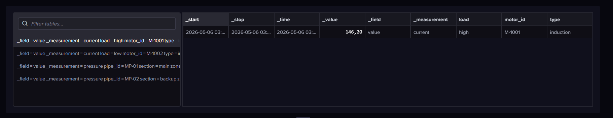

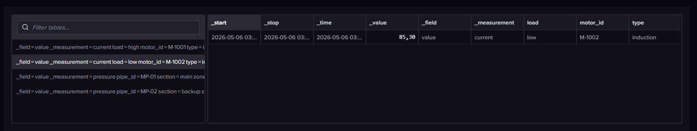

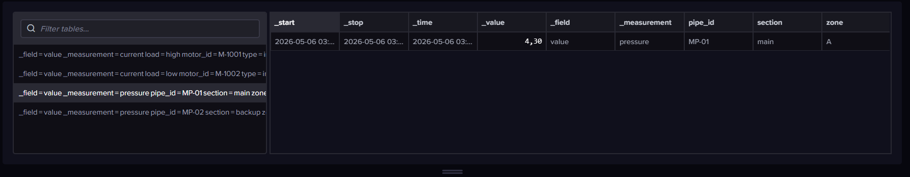

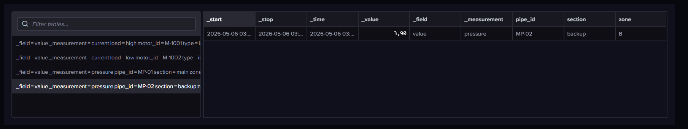

```flux
// 2. Только датчик тока M-1001
from(bucket: "sensor_data")
  |> range(start: -1h)
  |> filter(fn: (r) => r._measurement == "current" and r.motor_id == "M-1001")
```

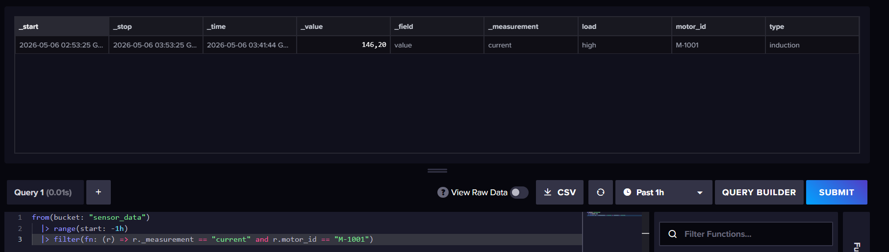

```flux
// 3. Максимальное значение тока на M-1001
from(bucket: "sensor_data")
  |> range(start: -1h)
  |> filter(fn: (r) => r._measurement == "current" and r.motor_id == "M-1001")
  |> max(column: "_value")
```

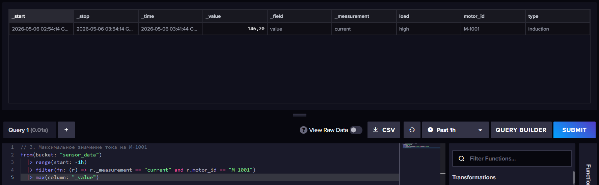

```flux
// 4. Среднее значение давления по трубе MP-01
from(bucket: "sensor_data")
  |> range(start: -1h)
  |> filter(fn: (r) => r._measurement == "pressure" and r.pipe_id == "MP-01")
  |> mean(column: "_value")
```

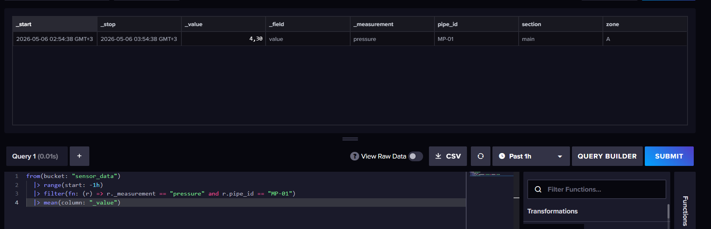

```flux
// 5. Аналитика: агрегация по окну 5 минут (средний ток по всем моторам)
from(bucket: "sensor_data")
  |> range(start: -1h)
  |> filter(fn: (r) => r._measurement == "current")
  |> aggregateWindow(every: 5m, fn: mean)
```

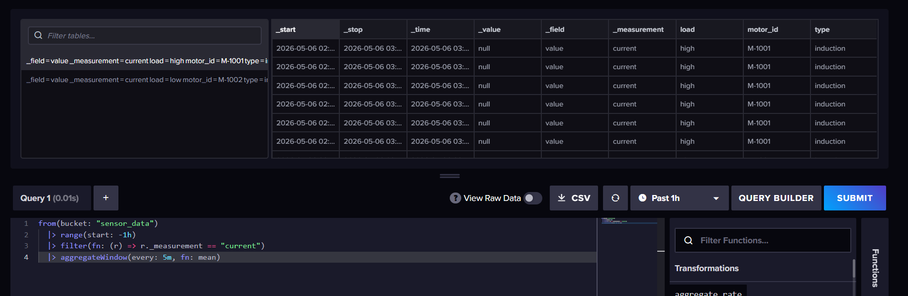

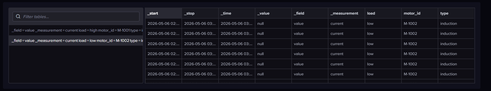

```flux
// Ток электродвигателя больше 100 А
from(bucket: "sensor_data")
  |> range(start: -1h)
  |> filter(fn: (r) => r._measurement == "current")
  |> filter(fn: (r) => r._field == "value")
  |> filter(fn: (r) => r._value > 100.0)
```

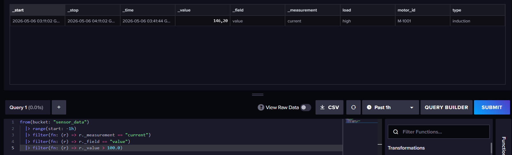

```flux
// Давление в трубопроводе ниже 4.0
from(bucket: "sensor_data")
  |> range(start: -1h)
  |> filter(fn: (r) => r._measurement == "pressure")
  |> filter(fn: (r) => r._field == "value")
  |> filter(fn: (r) => r._value < 4.0)
```

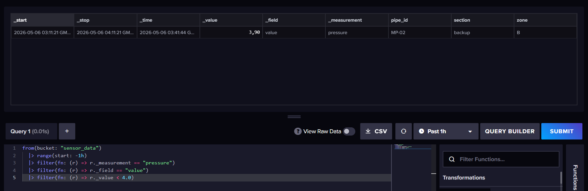

```flux
// Ток двигателя в диапазоне от 80 до 150 А
from(bucket: "sensor_data")
  |> range(start: -1h)
  |> filter(fn: (r) => r._measurement == "current")
  |> filter(fn: (r) => r._field == "value")
  |> filter(fn: (r) => r._value >= 80.0 and r._value <= 150.0)
```

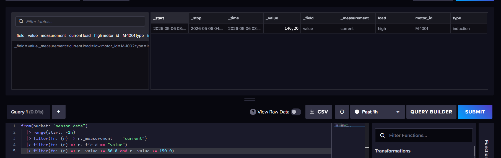

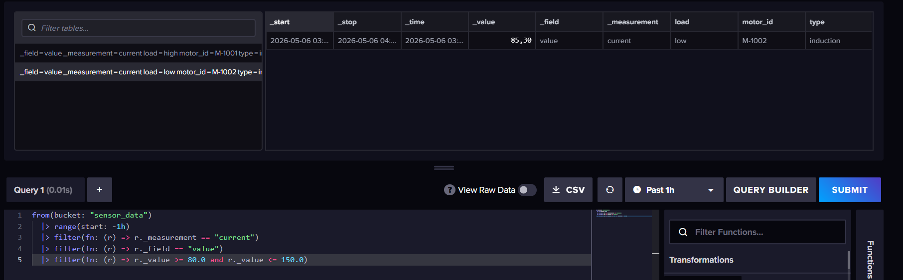

**Создание Dashboard**:  
`Dashboards` → `Create Dashboard` → `Add Cell` → вставить запрос → выбрать тип `Line Graph` → сохранить.

```flux
from(bucket: "sensor_data")
  |> range(start: -1h)
  |> filter(fn: (r) => r._measurement == "pressure")
  |> filter(fn: (r) => r.pipe_id == "MP-01")
  |> filter(fn: (r) => r._field == "value")
  |> aggregateWindow(every: 1m, fn: mean)
```

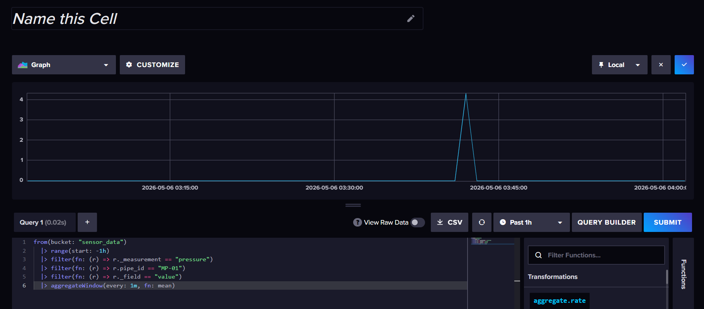