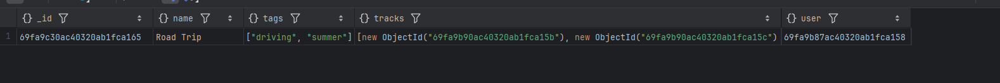
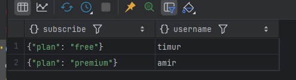
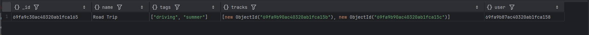
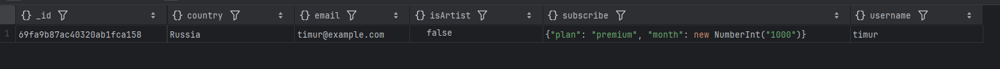
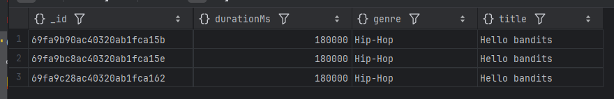
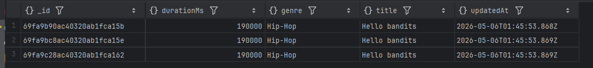
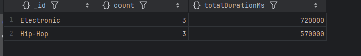

# Домашнее задание №6: MongoDB

## Задание

1. Поднять MongoDB в Docker Compose.
2. Создать 3 коллекции:
    - `users`
    - `tracks`
    - `playlists`
      причём хотя бы две связаны через `ObjectId`, и хотя бы один документ содержит вложенный объект или массив.
3. Наполнить каждой коллекции данными (минимум 2-3 документа).
4. Написать два `find` запроса (один с projection).
5. Написать два `update` запроса.
6. Написать один запрос с `aggregate` (например, группировку).

## Запуск

```bash
docker compose up -d
docker exec -it mongodb-lab mongosh -u root -p root
```

**Создание коллекций и данных**:

```js
use mydb;

// 1. Вставляем пользователей
db.users.insertMany([
    {
        username: "timur",
        email: "timur@example.com",
        country: "Russia",
        subscribe: { plan: "free", month: 100 },
        isArtist: false
    },
    {
        username: "amir",
        email: "amir@example.com",
        country: "Russia",
        subscribe: { plan: "premium", month: 500 },
        isArtist: true
    }
]);

// 2. Получаем _id пользователей
var timurId = db.users.findOne({ username: "timur" })._id;
var amirId = db.users.findOne({ username: "amir" })._id;

// 3. Вставляем треки (artist = amir)
db.tracks.insertMany([
    {
        title: "Hello bandits",
        durationMs: 180000,
        artist: amirId,
        album: "Album 1",
        genre: "Hip-Hop",
        createdAt: new Date()
    },
    {
        title: "Sunset",
        durationMs: 240000,
        artist: amirId,
        album: "Sunset EP",
        genre: "Electronic",
        createdAt: new Date()
    }
]);

// 4. Получаем _id треков
var track1Id = db.tracks.findOne({ title: "Hello bandits" })._id;
var track2Id = db.tracks.findOne({ title: "Sunset" })._id;

// 5. Вставляем плейлист (user = timur, tracks = массив ObjectId)
db.playlists.insertOne({
    name: "Road Trip",
    user: timurId,
    tracks: [track1Id, track2Id],
    tags: ["driving", "summer"]
});

// 6. Проверка
db.playlists.findOne({ name: "Road Trip" });
```



**Запросы**:

```js
// 1. find с projection (только username и subscribe.plan, без _id)
db.users.find({ country: "Russia" }, { username: 1, "subscribe.plan": 1, _id: 0 })
```



```js
// 2. find c массивом (playlists, где есть тег "summer")
db.playlists.find({ tags: "summer" })
```



```js
// 3. updateOne – изменить план подписки
db.users.updateOne(
  { username: "timur" },
  { $set: { "subscribe.plan": "premium", "subscribe.month": 1000 } }
)
db.users.findOne({ username: "timur" })
```



```js
db.tracks.find({ genre: "Hip-Hop" }, { title: 1, durationMs: 1, genre: 1 });
// 4. updateMany – увеличить длительность всех треков жанра Hip-Hop на 10 секунд
db.tracks.updateMany(
  { genre: "Hip-Hop" },
  { $inc: { durationMs: 10000 }, $currentDate: { updatedAt: true } }
)
db.tracks.find({ genre: "Hip-Hop" }, { title: 1, durationMs: 1, genre: 1, updatedAt: 1 });
```




```js
// 5. aggregate – подсчитать общую длительность треков по жанрам
db.tracks.aggregate([
  { $group: { _id: "$genre", totalDurationMs: { $sum: "$durationMs" }, count: { $sum: 1 } } },
  { $sort: { totalDurationMs: -1 } }
])
```

