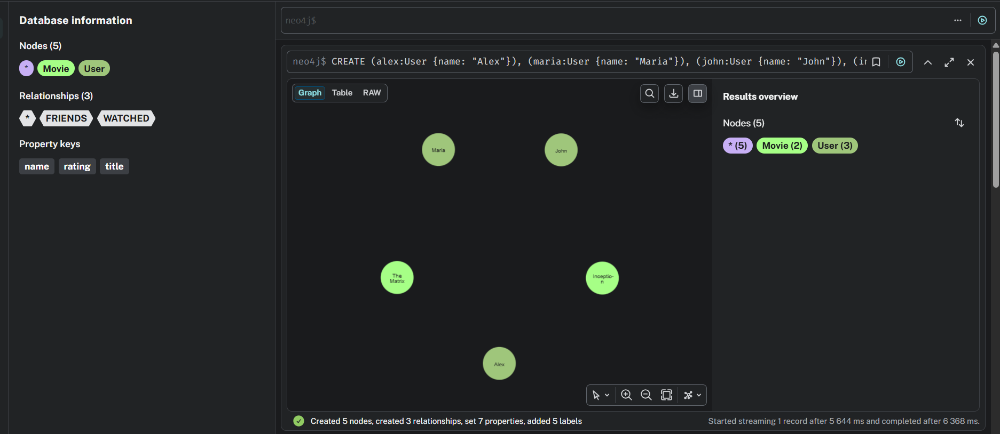
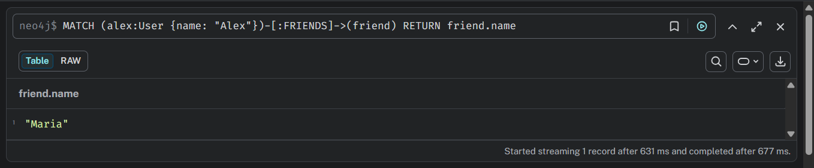
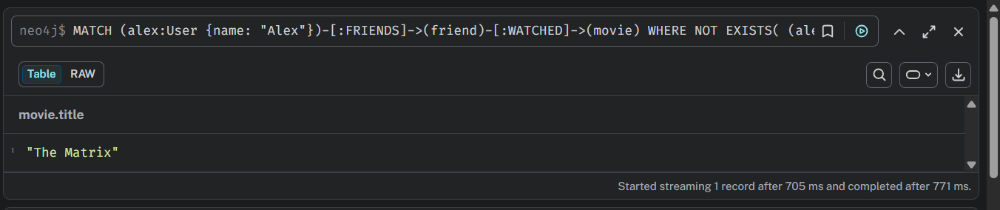

# Домашнее задание №8: Neo4j

## Задание

1. Запустить Neo4j (Docker Compose).
2. Создать граф (пользователи Alex, Maria, John; фильмы Inception, Matrix; дружба Alex→Maria; просмотр Alex→Inception).
3. Выполнить запросы:
    - Найти всех друзей Алекса.
    - Найти фильмы, которые смотрели друзья Алекса, но не смотрел сам Алекс.
4. Написать аналогичные запросы на SQL (для воображаемых таблиц) и сравнить сложность.

## Запуск

```bash
docker compose up -d
```

### Решение

Открыть `http://localhost:7474`

**Cypher-запросы**:

```cypher
// Создание узлов и связей
CREATE (alex:User {name: "Alex"}),
       (maria:User {name: "Maria"}),
       (john:User {name: "John"}),
       (inception:Movie {title: "Inception"}),
       (matrix:Movie {title: "The Matrix"})
CREATE (alex)-[:FRIENDS]->(maria)
CREATE (alex)-[:WATCHED {rating: 5}]->(inception)
CREATE (maria)-[:WATCHED {rating: 4}]->(matrix)
RETURN *
```



```cypher
// 1. Найти всех друзей Алекса
MATCH (alex:User {name: "Alex"})-[:FRIENDS]->(friend)
RETURN friend.name
```



```cypher
// 2. Фильмы, которые смотрели друзья Алекса, но не смотрел сам Алекс
MATCH (alex:User {name: "Alex"})-[:FRIENDS]->(friend)-[:WATCHED]->(movie)
WHERE NOT EXISTS( (alex)-[:WATCHED]->(movie) )
RETURN DISTINCT movie.title
```



**Аналоги на SQL**:

```sql
-- Друзья Алекса
SELECT u2.name
FROM users u1
JOIN friends f ON u1.id = f.user_id
JOIN users u2 ON f.friend_id = u2.id
WHERE u1.name = 'Alex';
```
```sql
-- Фильмы друзей Алекса, не просмотренные Алексом
SELECT DISTINCT m.title
FROM users u1
JOIN friends f ON u1.id = f.user_id
JOIN users u2 ON f.friend_id = u2.id
JOIN watched w ON u2.id = w.user_id
JOIN movies m ON w.movie_id = m.id
WHERE u1.name = 'Alex'
  AND NOT EXISTS (
    SELECT 1 FROM watched w2
    WHERE w2.user_id = u1.id AND w2.movie_id = m.id
  );
```

**Сравнение сложности**:
- В Neo4j запросы короче, интуитивно понятны, не требуют множественных JOIN и подзапросов. Производительность при глубоких связях (друзья друзей и т.д.) остаётся линейной от числа обходов, тогда как в PostgreSQL число JOIN растёт экспоненциально.
- SQL-запрос становится громоздким при росте глубины связей (например, для “друзей друзей друзей” потребуется 3 JOIN и более сложная логика).
