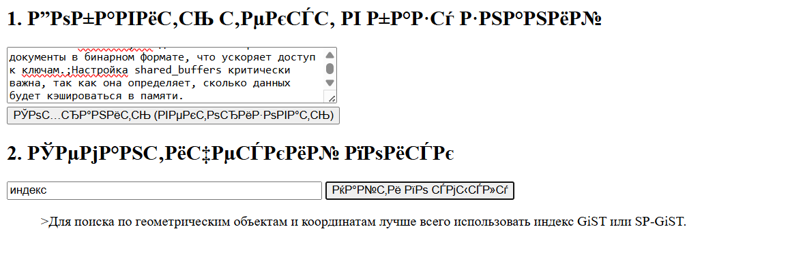
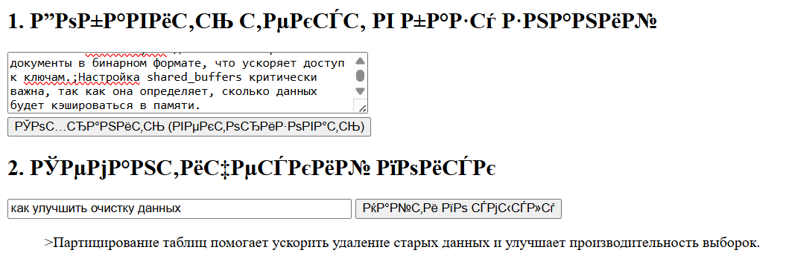
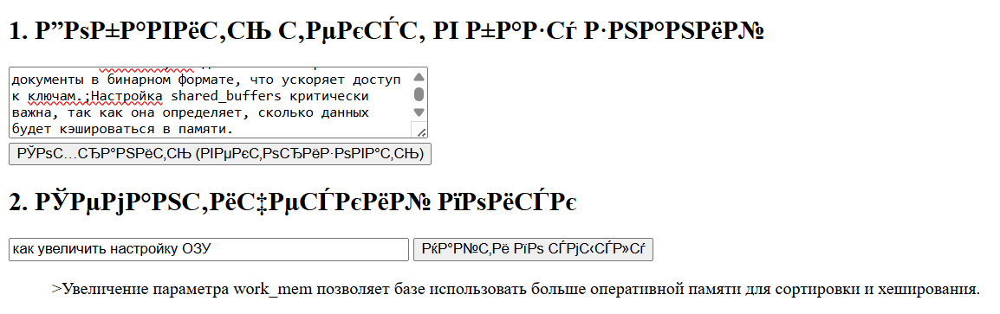
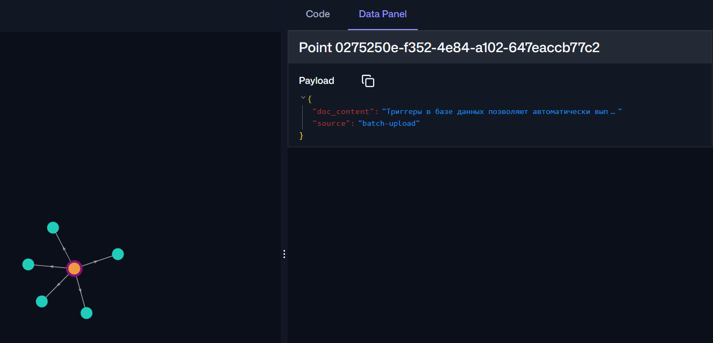

# Домашнее задание №7: Qdrant

## Задание

1. Склонировать репозиторий `https://github.com/ZhenShenITIS/hw-qdrant`
2. Запустить `docker compose up -d --build`
3. Подождать 5–10 минут (загрузка модели)
4. Открыть `http://localhost:8080/`
5. Вставить текст (пример с PostgreSQL-советами, разделённый `;`)
6. Попробовать семантический поиск (примеры: *"как искать по формам"*, *"как улучшить очистку данных"*, *"как увеличить настройку ОЗУ"*)
7. Перейти на `http://localhost:6333/dashboard` и посмотреть коллекцию `demo_collection`, выполнить пример запроса с LIMIT 15.

## Запуск

```bash
docker compose up -d
```

## Семантический поиск







## Просмотр коллекции

