# Домашнее задание №1: Redis / Valkey

## Задание (из курса)

1. Запустить Redis/Valkey через Docker.
2. Создать Hash с данными о 3 студентах (имя, группа, средний балл).
3. Реализовать лидерборд (Sorted Set) по среднему баллу. Вывести топ-3.
4. Реализовать простую очередь задач (List): добавить 5 задач, забрать 3.
5. Установить TTL на один из ключей, убедиться, что он удалился.
6. Выполнить транзакцию MULTI/EXEC: перевод «баллов» между двумя студентами.
7. *Бонус: Pub/Sub.

## Запуск

```bash
docker compose up -d
docker exec -it redis-lab redis-cli
```

## Решение

# 1. Hash студентов
```redis
HSET student:1 name "Иван" group "11-400" gpa 4.2
HSET student:2 name "Мария" group "11-400" gpa 4.8
HSET student:3 name "Петр" group "11-401" gpa 3.9

HGETALL student:1
HGETALL student:2
HGETALL student:3
```

## Вывод

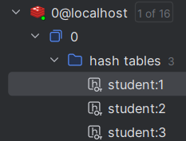

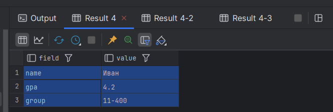

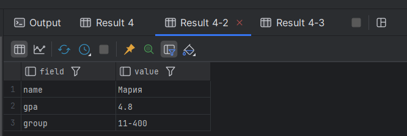

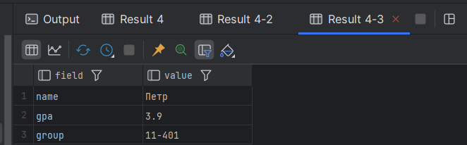


# 2. Лидерборд и Топ-3 (по убыванию)
```redis
ZADD leaderboard 4.2 "Иван" 4.8 "Мария" 3.9 "Петр"
ZREVRANGE leaderboard 0 2 WITHSCORES
```

## Вывод 
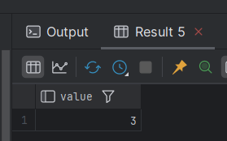

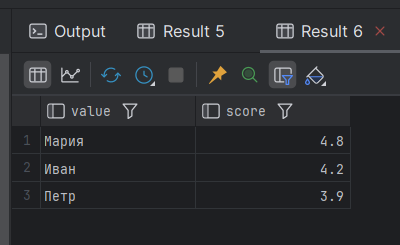

# 3. Очередь задач (List)
```redis
RPUSH tasks "task1: отправить отчет" "task2: созвон" "task3: написать код" "task4: проверить ДЗ" "task5: залить проект"
LPOP tasks   
LPOP tasks   
LPOP tasks   
LLEN tasks   
```

# Вывод

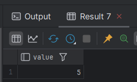

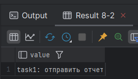

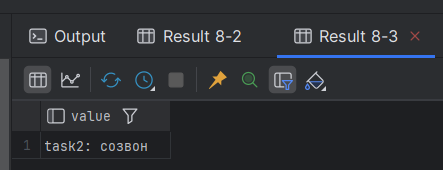

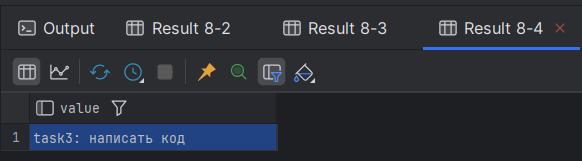

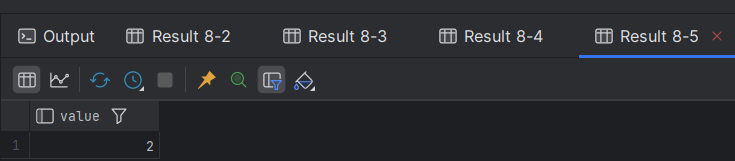

# 4. TTL
```redis
SET temp_key "удалюсь через 10 секунд" EX 10
TTL temp_key
# подождать 10 секунд
GET temp_key
```

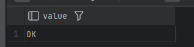

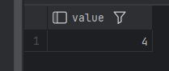

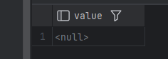

# 5. Транзакция – перевод баллов между студентами
```redis
MULTI
HINCRBYFLOAT student:1 gpa -0.2
HINCRBYFLOAT student:2 gpa 0.2
EXEC
HGETALL student:1
HGETALL student:2
```
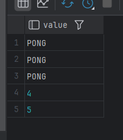

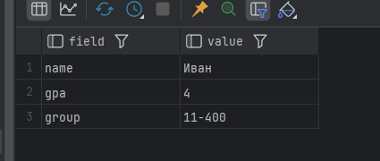

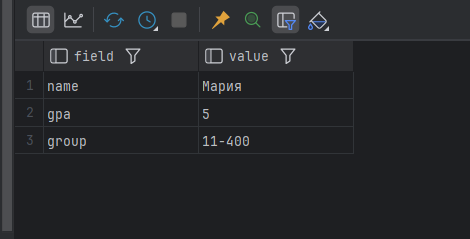

# 6. Бонус – Pub/Sub (открыть два терминала)
# Терминал 1:
```redis
SUBSCRIBE news
```

# Терминал 2:

```redis
PUBLISH news "Привет из Redis!"
```

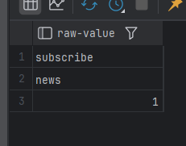

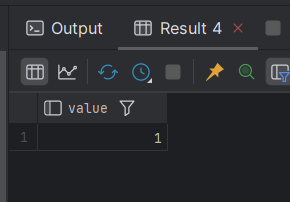