# 1
## запрос
```sql
SELECT ctid, xmin, xmax, * FROM warehouse.customer LIMIT 1;
```
## результат
```
"(0,1)",1617,0,1,Фадеева,Александра,Лука,newemail@example.com,"{""registered"": ""2024-06-01"", ""preferences"": {""newsletter"": false}}","{tag3,tag2}"
```
xmin – XID создавшей транзакции,
xmax – XID удалившей/заблокировавшей транзакции,
ctid – физическое расположение строки (страница, номер строки).
3 значение (xmax = 0) говорит о том, что запись актуальна

# 2
## запрос
получаем на 0 странице строку 1
```sql 
SELECT lp, t_infomask
FROM heap_page_items(get_raw_page('warehouse.customer', 0))
WHERE lp = 1;
```
## результат
```
1,10498
```
```
10498 = 0x2902.
Разложим это значение по стандартным флагам PostgreSQL:
0x0002 (HEAP_HASNULL): В строке есть хотя бы одно поле со значением NULL.
0x0100 (HEAP_XMIN_COMMITTED): Транзакция, которая вставила строку, успешно зафиксирована (committed). Строка «видна» всем.
0x0800 (HEAP_XMAX_COMMITTED): Транзакция, которая удалила или обновила строку, тоже зафиксирована.
0x2000 (HEAP_UPDATED): Эта строка была обновлена (создана новая версия, а эта — старая).
```

# 3
## запрос 1 транзакции
```sql
BEGIN;
SELECT xmin, xmax, ctid, id FROM warehouse.customer WHERE id = 1;

UPDATE warehouse.customer SET last_name = 'Петров_новый' WHERE id = 1;
SELECT xmin, xmax, ctid, id FROM warehouse.customer WHERE id = 1;
```
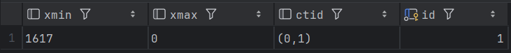
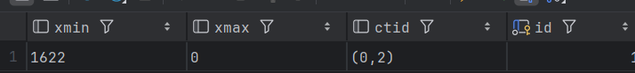
## запрос 2 транзакции
```sql
SELECT xmin, xmax, ctid, id FROM warehouse.customer WHERE id = 1;
```
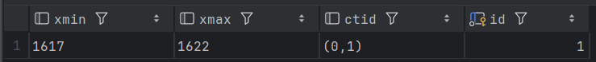
видим только закомиченные данные. При этом видно что xmax = 1622, это значит, что данные были изменены другой транзакцией(первой) и пока не были закомиченны 

После коммита:
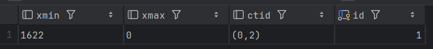

# 4
## транзакция 1
```sql
BEGIN;
UPDATE warehouse.customer SET last_name = 'A' WHERE id = 1;
```
## транзакция 2
```sql
BEGIN;
UPDATE warehouse.customer SET last_name = 'B' WHERE id = 2;
```
## транзакция 1
```sql
UPDATE warehouse.customer SET last_name = 'B' WHERE id = 2;
```
## транзакция 2
```sql
UPDATE warehouse.customer SET last_name = 'A' WHERE id = 1;
```
во второй транзакции получили ошибку:
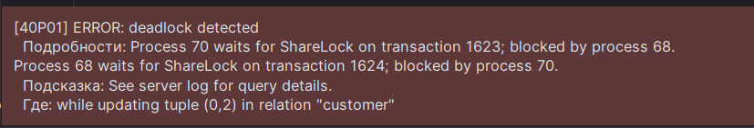

первая продолжила своё выполнение

# 5.1
## транзакция 1
```sql
BEGIN;
LOCK TABLE warehouse.customer IN ACCESS EXCLUSIVE MODE;
```
## транзакция 2
```sql
SELECT * FROM warehouse.customer LIMIT 1;
```
получили ошибку в транзакции 2:
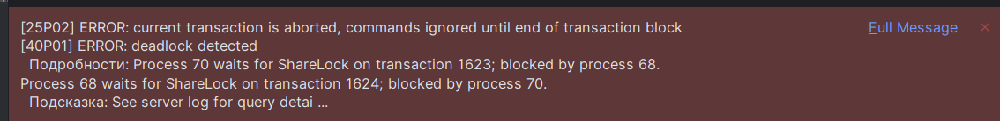


# 5.2
## транзакция 1
```sql
BEGIN;
LOCK TABLE warehouse.customer IN SHARE MODE;
```
## транзакция 2
```sql
UPDATE warehouse.customer
SET last_name = 'stashkov'
WHERE id = 1;
```
получили ошибку в транзакции 2:
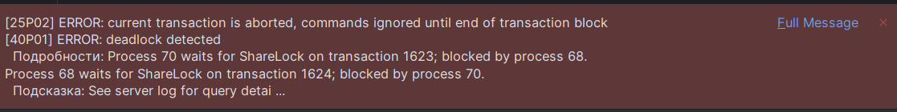

# бллокировка на уровне строк
## транзакция 1
```sql
BEGIN;
SELECT * FROM warehouse.customer WHERE id = 1 FOR UPDATE;
```
## транзакция 2
```sql
BEGIN;
SELECT * FROM warehouse.customer WHERE id = 1 FOR SHARE;
```
в транзакции 2 ошибку не получили, но запрос заблокировался(время выполнения больше 11 секунд) 
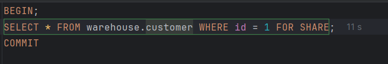

# Очистка данных 

```sql
SELECT pg_size_pretty(pg_total_relation_size('warehouse.customer')) AS size;
```
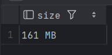
```sql
UPDATE warehouse.customer
SET last_name = last_name || '_X'
WHERE id IN (SELECT id FROM warehouse.customer WHERE id > 0 LIMIT 100);
```

```sql
SELECT n_dead_tup FROM pg_stat_user_tables WHERE relname = 'customer';
```
как раз 100 не актуальных версий записей
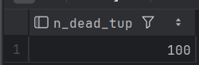

```sql
VACUUM warehouse.customer;
```
после этого объём таблицы не изменился, а количество неактивных записей обнулилось

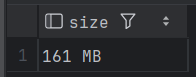
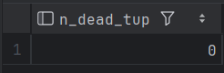

При этом пытался изменить большое количество строк во всей таблице customer. Количество неактивных записей было равно нулю. По всей видимости срабатывал autovacuum 


